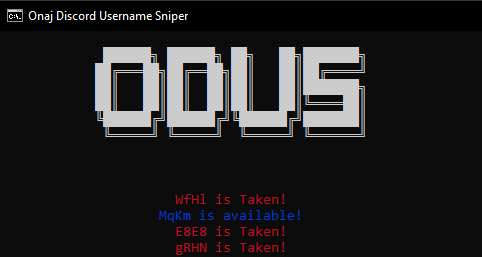

  
ODUS is a free program that will check random usernames on discord, you can customize Delay, How many characters the username has, as well as a webhook that will send working usernames.

  

    
  

  

    
    
    
  

## More About the Program
- {x} [Download Last Release](https://github.com/onajlikezz/OnajDiscordUsernameSniper/releases)
- {x} [YouTube Tutorial](https://www.youtube.com/watch?v=WnMs0cusbwk)
- {x} [Support](#SUPPORT)

## SUPPORT
If you have any questions [click here](https://discord.gg/pBFaCQQVBV) to enter discord server

<!--🐍📈SNAKEGRAPH / 🌐WEBSITE: https://github.com/Platane/snk -->

